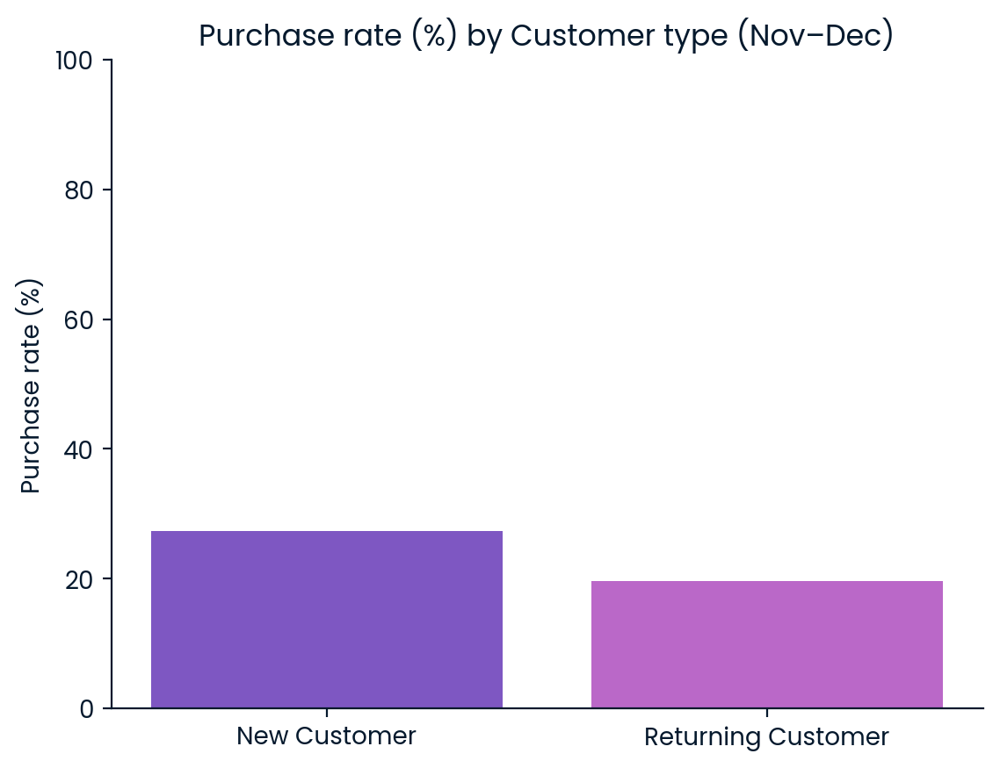
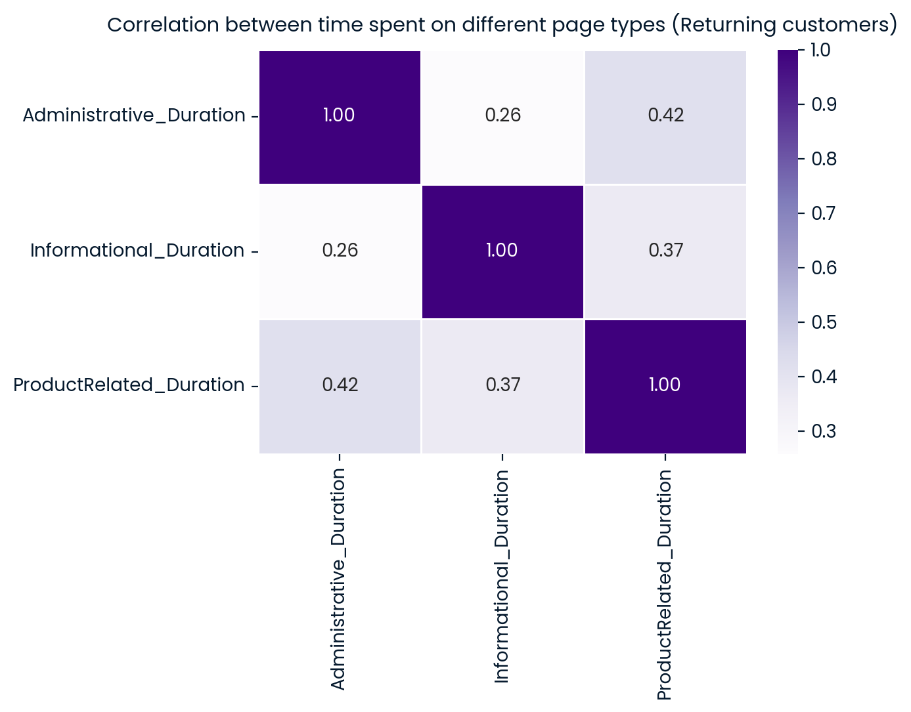
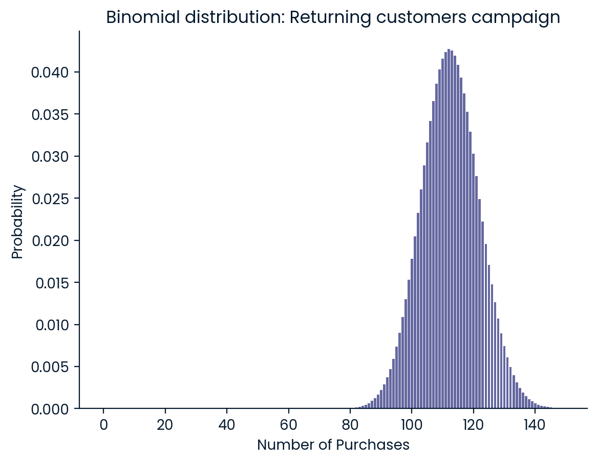

# Will this customer purchase your product?

**Timeframe:** January 2023 – July 2024  
**Location:** United States  
**Dataset size:** 10,746 customers  
**Tools:** Python

## Project overview
This project analyses online shopping behaviour during November and December, the busiest shopping months of the year.  
The goal is to understand how new and returning customers behave differently, what browsing patterns drive purchase decision, and how a marketing campaign could improve conversions.

The analysis focuses on three main questions:
1. How do purchase rates differ between new and returning customers?  
2. Which browsing behaviours (page durations) are most correlated?  
3. What is the probability that a new marketing campaign achieves its target sales?

The goal is to translate data patterns into actionable marketing insights and quantifiable business outcomes.

This project was inspired by the [DataCamp Real World Project – *Will This Customer Purchase Your Product?*](https://app.datacamp.com/learn/projects/2470), with extended analysis, visualisations and business insights.

The datasets used in this analysis can be found [here](online_shopping_session_data.csv).  
The Python analysis (Jupyter notebook) can be found [here](analysis.ipynb).  

---

## Dataset description

The dataset includes 10,746 sessions recorded between January 2023 and July 2024, covering both new and returning customers across the US.

| Column | Description |
|--------|--------------|
| `Administrative`, `Administrative_Duration` | Number and duration of visits to administrative pages |
| `Informational`, `Informational_Duration` | Number and duration of visits to informational pages |
| `ProductRelated`, `ProductRelated_Duration` | Number and duration of visits to product pages |
| `BounceRates`, `ExitRates` | Website behavioural metrics |
| `PageValues` | Average page value in the session |
| `SpecialDay`, `Weekend`, `Month` | Contextual and seasonal features |
| `CustomerType` | Type of visitor (Returning or New) |
| `Purchase` | Whether a purchase occurred (1 = Yes, 0 = No) |

---

## Methodology

The analysis follows a structured workflow:
1. Data cleaning and preparation 
   - Duplicates removed, data types corrected, categorical values standardised.  
   - Focused on sessions from November–December to capture peak-season behaviour.
     
2. Exploratory Data Analysis (EDA)  
   - Calculated purchase rates by customer type.  
   - Correlation matrix created for browsing time metrics.  
   - Statistical simulation performed using binomial probability.
     
3. Visualisation  
   - Charts created using `matplotlib` and `seaborn` for clarity and interpretability.

---

## Results and insights

### Purchase rate by customer type

| Customer type | Purchase rate |
|----------------|----------------|
| New customer | 27.3% |
| Returning customer | 19.6% |

#### Visualisation

Analysis of online shopping sessions during the busiest months (November–December) reveals a noticeable difference in purchase likelihood between new and returning customers.
- New customers converted at an average rate of 27.3%, while
- Returning customers converted at 19.6%.

Although returning users are typically expected to have higher purchase intent due to prior familiarity, the data suggests the opposite. This might indicate that:
- The company’s holiday campaigns and promotions are particularly effective at attracting first-time buyers.
- Returning visitors could be browsing more without necessarily repurchasing, possibly comparing offers or waiting for better deals.
  
From a marketing perspective
- The higher conversion rate among new customers suggests strong acquisition performance, but weaker retention.
- Efforts should be made to re-engage returning customers such as through personalised email recommendations, loyalty discounts or targeted remarketing.

---

### Correlation between page durations (Returning customers)

The strongest relationship was observed between Administrative_Duration and ProductRelated_Duration, with a correlation coefficient of 0.42.

| Page duration pair | Correlation |
|--------------------|-------------|
| Administrative ↔ ProductRelated | 0.42 |
| Informational ↔ ProductRelated | 0.37 |
| Administrative ↔ Informational | 0.26 |

#### Visualisation

The heatmap illustrates the relationships between the time returning customers spent on different types of web pages during November and December.

Notably, the time spent on Administrative pages and Product-related pages shows the strongest correlation (0.42). This suggests that when returning customers spend more time managing their accounts or navigating transactional pages, they also tend to spend more time viewing product details. In other words, these users are likely to be engaged in goal-oriented, purchase-driven browsing behaviour, taking time to evaluate products before making a buying decision.

Meanwhile, the weaker correlations involving Informational pages (0.26–0.37) indicate that reading general content or site information plays a smaller role in their purchasing journey.

Overall, the results point towards a focused and intentional shopping pattern among returning customers that they interact mainly with pages that directly support purchasing decisions rather than casual browsing.

---

### Probability of campaign success

A hypothetical marketing campaign was designed to increase returning customers’ purchase rate by 15%. 
A binomial probability model was used to estimate the likelihood of achieving at least 100 purchases out of 500 sessions.

| Metric | Value |
|--------|--------|
| Baseline Purchase Rate | 0.196 |
| Adjusted Rate (+15%) | 0.225 |
| Sessions Simulated | 500 |
| Probability ≥ 100 Purchases | 91.9% |

#### Visualisation

The binomial probability distribution illustrates the likelihood of achieving at least 100 purchases out of 500 online shopping sessions by returning customers after a 15% increase in their purchase rate.

The calculated probability is approximately 91.9%, indicating a very strong likelihood that the campaign will reach or exceed the target of 100 sales. The distribution is centred around the mean of roughly 110 purchases, suggesting that most expected outcomes fall comfortably above the target threshold.

From a business perspective, this implies that the marketing campaign aimed at returning customers is highly promising. The uplift in conversion rate significantly boosts expected sales performance, demonstrating that investing in re-engagement and loyalty-based campaigns could deliver substantial returns during peak shopping months.

---

## Key findings

**Acquisition outperformed retention**  
New customers converted at a higher rate, reflecting the success of holiday campaigns in attracting new visitors.

**Returning customers are deliberate browsers**  
Their time distribution suggests intentional research before buying, offering opportunities for targeted product recommendations.

**Retention marketing pays off**  
A 15% increase in conversion among returning users can achieve campaign success with 91.9% certainty.

**Behavioural patterns reveal intent**   
Duration correlations can help identify high-intent users and tailor personalised engagement strategies.

---

## Business implications

- Optimise promotions for new users while designing personalised loyalty campaigns for returning customers.  
- Use page duration metrics to segment visitors by intent, prioritising follow-up actions for high-engagement sessions.  
- Measure campaign ROI through probabilistic models instead of simple averages to better capture uncertainty.
